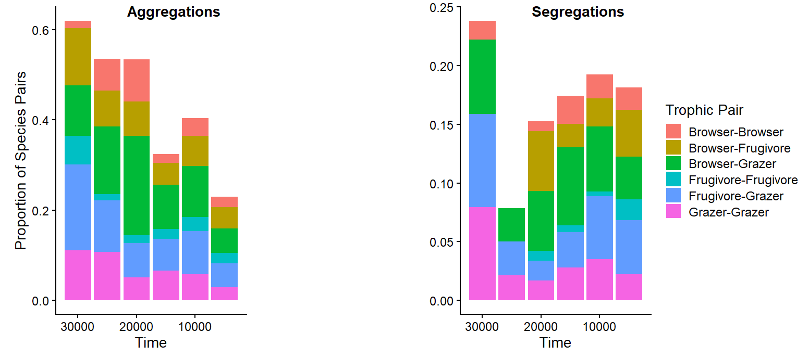
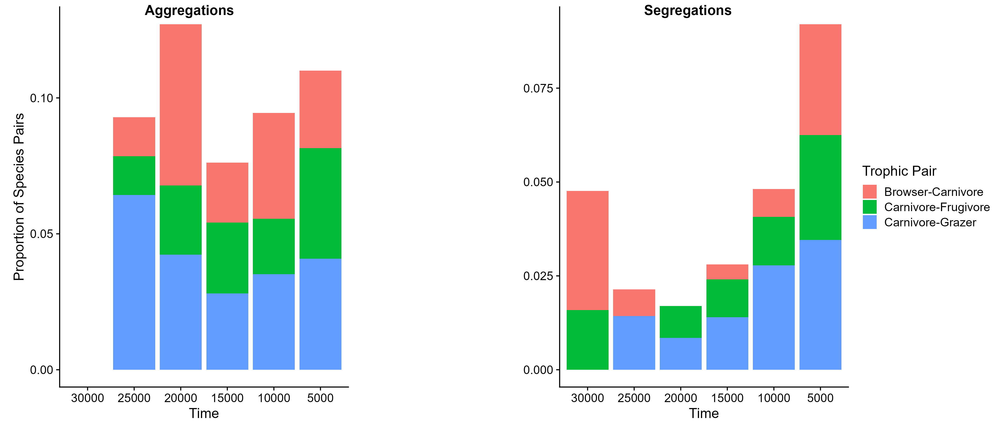
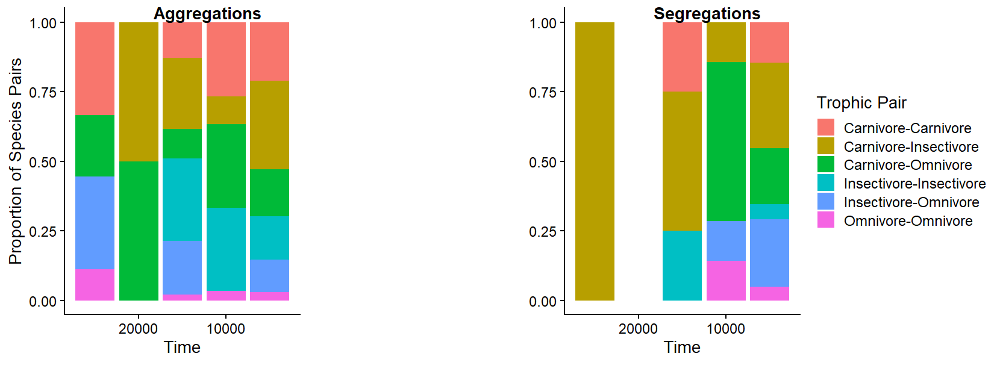

## 1. Introduction

  The rise and expansion of humans at the End of the Pleistocene led to a large extinction event at the end of the Pleistocene. This extinction saw the loss of large bodied mammals across the globe with a size selectivity previously not seen before. The loss of so many large mammals lead to many different effects and changes to community composition and structure. One of these effects was a shift from aggregated species pairs to segregated species pairs. When two species are associated with each other more than expected by chance, they are said to cooccur. This cooccurrence can either be positive (aggregations) where the two species are associated more than expected by chance, or negative (segregations) where the two species are separated more than expected by chance. This shift to segregations likely represents a loss of biotic interactions that were held by the Megafauna, although it is unclear whether this change in community structure was equal across different trophic guilds. Here, we investigate whether the proportions of aggregated and segregated pairs through time changed based on what diets the component animals had.

```{r setup, include=FALSE}
knitr::opts_chunk$set(echo = TRUE)
```

## 2. Code

#### Setting up Data and Using the Cooccur Package

For this project, our data output is a presence-absence matrix of North American Mammals for different sites in different time periods within the last 30000 years. 

```{r}
CoMatrix=read.csv("data/Complete PAtable_new.csv")
```

This dataframe is now present for the analysis with species as columns and sites as rows, with a 0 denoting an absence from that site and a 1 denoting a presence in that site.

We will be using the cooccur package in R to run the cooccurence analysis. 
```{r, message=F}
library(ggplot2)
library(cowplot)
library(tidyverse)
library(gmp)
library(reshape2)
library(cooccur)
```

This package does a co-occurance analysis on dataframes but requires the sites to be the columns and the species to be rows, so We have to change the dataframe.

```{r}
CoMatrixFix=data.frame(t(CoMatrix[-1]))
colnames(CoMatrixFix)= CoMatrix[,1]
```
Now we made sites the columns so that we can run the analysis.

We want to do the analysis separately for different chunks of time however, so we need to separate the matrix into time bins to run separate analyses on.

```{r}
Timebin1=CoMatrixFix[,CoMatrixFix[1,]<=30000 & CoMatrixFix[1,]>=25000]
Timebin2=CoMatrixFix[,CoMatrixFix[1,]<25000 & CoMatrixFix[1,]>=20000]
Timebin3=CoMatrixFix[,CoMatrixFix[1,]<20000 & CoMatrixFix[1,]>=15000]
Timebin4=CoMatrixFix[,CoMatrixFix[1,]<15000 & CoMatrixFix[1,]>=10000]
Timebin5=CoMatrixFix[,CoMatrixFix[1,]<10000 & CoMatrixFix[1,]>=5000]
Timebin6=CoMatrixFix[,CoMatrixFix[1,]<5000 & CoMatrixFix[1,]>=0]
```

Now that each of the time bins are denoted, we need to remove the time row from each matrix so that the analysis won't get confused.

```{r}
Bins=list(Timebin1,Timebin2,Timebin3,Timebin4,Timebin5,Timebin6)
Binsnoyearint=lapply(Bins, FUN=function(x)x[-1,] %>% mutate_all(as.integer))
```

Now we are ready to run the coocurrance analysis. Because of the size of the dataset, I'm going to load the output as a saved file. The code for the analysis is as follows:

coocfun= lapply(Binsnoyearint,
                FUN=function(x)cooccur(mat=x, thresh=TRUE, type="spp_site",spp_names=TRUE))
            
CoocTime1=coocfun[[1]]
                
CoocTime2=coocfun[[2]]

CoocTime3=coocfun[[3]]

CoocTime4=coocfun[[4]]

CoocTime5=coocfun[[5]]

CoocTime6=coocfun[[6]]

Cooctotals=list(CoocTime1,CoocTime2,CoocTime3,CoocTime4,CoocTime5,CoocTime6)
                
```{r}
load("data/Cooctotals.rdata")
```

#### Analysing the Results: Proportions of Aggregated Pairs

Now that we have the results from the cooccurrance analysis the first thing we want to do is see how the proportion of aggregated pairs changes through time to compare it to previous findings.

```{r}
TotalProportionsAgg=lapply(Cooctotals,FUN=function(x) (x$positive)/(x$co_occurrences))
```

We calculate the proportion of Aggregations as the total number of positive pairs over the total number of significant pairs for each time bin. 

Next we want to turn this combined dataframe into a dataframe that makes sense so that we can visualize these proportions through time.

```{r}
TotalProportionsAgg=as.data.frame(TotalProportionsAgg)
TotalProportionsAgg[nrow(TotalProportionsAgg)+1,]=c("30000","25000","20000","15000","10000","5000")
TotalProportionsAgg=data.frame(t(TotalProportionsAgg))
TotalProportionsAgg$X1=as.numeric(TotalProportionsAgg$X1)
TotalProportionsAgg$X2=factor(TotalProportionsAgg$X2, levels=c("30000","25000","20000","15000","10000","5000"))
```

Here we have organized the dataframe and gave it the right labels, restructuring it and changing the object types to be able to graph it, which we can now do.

```{r}
ggplot(TotalProportionsAgg, aes(x=X2,y=X1))+geom_bar(stat="identity", fill="tomato", width=0.5, color="black",linewidth=1)+
  theme_cowplot()+labs(x="Time",y="Proportion of Aggregated Pairs", title="Proportion of Aggregated Pairs Through Time in North America")+
  theme(plot.title=element_text(size=11.5), axis.title.y=element_text(size=10),
           axis.title.x=element_text(size=10),axis.text.y=element_text(size=10))+
  coord_cartesian(ylim=c(0.4,0.9))
```

#### Analysing the Results: Diet Pairs

```{r}
SpeciesDiets=read.csv("data/TraitdataTestVersion.csv")
```

Now we want to incorporate the diet data which I have in its own dataframe. Each species from the presence-absence matrix is in this dataframe with a diet category assigned to it: Either Carnviore, Grazer, Browser, Frugivore, Omnivore or Insectivore.

The first step is to merge the diet dataframe with a dataframe that has the species pairs and the results from the analysis, which we can do using the prob.table function in the cooccur package.

```{r}
probtable1=prob.table(Cooctotals[[1]])
probtable1=probtable1%>%left_join(SpeciesDiets %>% select(sppname, Diet), by=join_by("sp1_name"=="sppname"))%>%rename(sp1_diet=Diet)%>%
  left_join(SpeciesDiets%>% select(sppname, Diet), by=join_by("sp2_name"=="sppname"))%>%rename(sp2_diet=Diet)
probtable1$Pairtype[probtable1$p_gt<=0.05] = "Positive"
probtable1$Pairtype[probtable1$p_lt<=0.05]="Negative"
probtable1$Pairtype[probtable1$p_gt>0.05 & probtable1$p_lt>0.05]="Random"
probtable1$time=30000
```

Here, for the first time bin, we get a probtable from the Cooccur results for the first time bin. This table has the names of each species and the probability of the pair cooccuring more (pgt) or less (plt) by chance. Pairs that have a pgt less than an alpha value of 0.05 are positive, while pairs that have a plt less than 0.05 are negative. If neither are below 0.05, they are considered not significant pairs. 

We then repeat this step of joining the diet data to the results and describing pairs as Positive, Negative or Random for the other 5 time bins.

```{r, warning=F}
probtable2=prob.table(Cooctotals[[2]])
probtable2=probtable2%>%left_join(SpeciesDiets %>% select(sppname, Diet), by=join_by("sp1_name"=="sppname"))%>%rename(sp1_diet=Diet)%>%
  left_join(SpeciesDiets%>% select(sppname, Diet), by=join_by("sp2_name"=="sppname"))%>%rename(sp2_diet=Diet)
probtable2$Pairtype[probtable2$p_gt<=0.05] = "Positive"
probtable2$Pairtype[probtable2$p_lt<=0.05]="Negative"
probtable2$Pairtype[probtable2$p_gt>0.05 & probtable2$p_lt>0.05]="Random"
probtable2$time=25000

probtable3=prob.table(Cooctotals[[3]])
probtable3=probtable3%>%left_join(SpeciesDiets %>% select(sppname, Diet), by=join_by("sp1_name"=="sppname"))%>%rename(sp1_diet=Diet)%>%
  left_join(SpeciesDiets%>% select(sppname, Diet), by=join_by("sp2_name"=="sppname"))%>%rename(sp2_diet=Diet)
probtable3$Pairtype[probtable3$p_gt<=0.05] = "Positive"
probtable3$Pairtype[probtable3$p_lt<=0.05]="Negative"
probtable3$Pairtype[probtable3$p_gt>0.05 & probtable3$p_lt>0.05]="Random"
probtable3$time=20000

probtable4=prob.table(Cooctotals[[4]])
probtable4=probtable4%>%left_join(SpeciesDiets %>% select(sppname, Diet), by=join_by("sp1_name"=="sppname"))%>%rename(sp1_diet=Diet)%>%
  left_join(SpeciesDiets%>% select(sppname, Diet), by=join_by("sp2_name"=="sppname"))%>%rename(sp2_diet=Diet)
probtable4$Pairtype[probtable4$p_gt<=0.05] = "Positive"
probtable4$Pairtype[probtable4$p_lt<=0.05]="Negative"
probtable4$Pairtype[probtable4$p_gt>0.05 & probtable4$p_lt>0.05]="Random"
probtable4$time =15000

probtable5=prob.table(Cooctotals[[5]])
probtable5=probtable5%>%left_join(SpeciesDiets %>% select(sppname, Diet), by=join_by("sp1_name"=="sppname"))%>%rename(sp1_diet=Diet)%>%
  left_join(SpeciesDiets%>% select(sppname, Diet), by=join_by("sp2_name"=="sppname"))%>%rename(sp2_diet=Diet)
probtable5$Pairtype[probtable5$p_gt<=0.05] = "Positive"
probtable5$Pairtype[probtable5$p_lt<=0.05]="Negative"
probtable5$Pairtype[probtable5$p_gt>0.05 & probtable5$p_lt>0.05]="Random"
probtable5$time=10000

probtable6=prob.table(Cooctotals[[6]])
probtable6=probtable6%>%left_join(SpeciesDiets %>% select(sppname, Diet), by=join_by("sp1_name"=="sppname"))%>%rename(sp1_diet=Diet)%>%
  left_join(SpeciesDiets%>% select(sppname, Diet), by=join_by("sp2_name"=="sppname"))%>%rename(sp2_diet=Diet)
probtable6$Pairtype[probtable6$p_gt<=0.05] = "Positive"
probtable6$Pairtype[probtable6$p_lt<=0.05]="Negative"
probtable6$Pairtype[probtable6$p_gt>0.05 & probtable6$p_lt>0.05]="Random"
probtable6$time=5000
```

Now that each of the timebins has the diet data together, we can combine the six probtables together and modify them to analyse the diet pairs. We want to remove random pairs as we are not analyzing those, and we want to split the positive and negative pairs from each time bin into separate dataframes.

```{r}
Probtablecomb= list(probtable1,probtable2,probtable3,probtable4,probtable5,probtable6)
Probtablecomb= lapply(Probtablecomb,FUN=function(x)(x[x$Pairtype != "Random",]))
Splitprobtable= lapply(Probtablecomb, FUN=function(x)(split(x, x$Pairtype)))
Posprobtable= lapply(Splitprobtable, `[[`, "Positive")
Posprobtable=bind_rows(Posprobtable, .id="source")
Negprobtable= lapply(Splitprobtable, `[[`, "Negative")
Negprobtable=bind_rows(Negprobtable, .id="source")
```

Now for each dataframe we can make a new column for diet-pair, combining both diets from both species. We also need to make this combination alphabetical so that A-B is the same as B-A.

```{r}
Posprobtable$sp1_diet = as.character(Posprobtable$sp1_diet)
Posprobtable$sp2_diet = as.character(Posprobtable$sp2_diet)
Posprobtable$diet_pair = ifelse(is.na(Posprobtable$sp1_diet) | is.na(Posprobtable$sp2_diet),
                                      NA_character_, paste(pmin(Posprobtable$sp1_diet, Posprobtable$sp2_diet),
                                                           pmax(Posprobtable$sp1_diet, Posprobtable$sp2_diet),
                                                           sep="-"))

Negprobtable$sp1_diet = as.character(Negprobtable$sp1_diet)
Negprobtable$sp2_diet = as.character(Negprobtable$sp2_diet)
Negprobtable$diet_pair = ifelse(is.na(Negprobtable$sp1_diet) | is.na(Negprobtable$sp2_diet),
                                NA_character_, paste(pmin(Negprobtable$sp1_diet, Negprobtable$sp2_diet),
                                                     pmax(Negprobtable$sp1_diet, Negprobtable$sp2_diet),
                                                     sep="-"))
```

The next thing we need to do is calculate proportions of how many of each diet pair is present. We do this by making combined tables for positive and negative pairs and adding columns for the timebin, what diet pair it is and whether it is positive or negative. We then calculated the number of pairs of each diet type of each pair type and the total signficant pairs for each timebin. Proportions were calculated as the pair numbers over the total significant pairs. Finally we separated the positve and negative pairs again. 

```{r}
Comprobtable=bind_rows(Posprobtable, Negprobtable)
Comprobtable=Comprobtable%>% group_by(time, diet_pair, Pairtype)%>% summarise(pairnum=n(),.groups="drop")
Comprobtable=Comprobtable%>% complete(time, diet_pair, Pairtype, fill=list(pairnum=0))
Totalpairs=Comprobtable%>% group_by(time) %>% summarise(totalsig=sum(pairnum), .groups="drop")
Comprobtable=Comprobtable%>% left_join(Totalpairs, by="time")%>% mutate(proportion=pairnum/totalsig)
Comprobtable=Comprobtable%>% mutate(time=factor(time, levels=sort(unique(time),decreasing=T)))
Posprobtable=Comprobtable%>% filter(Pairtype=="Positive")
Negprobtable=Comprobtable%>% filter(Pairtype=="Negative")
```

We then split the different diet pairs into three different groups to graph separately. We made a group for herbivore pairs, like browser and grazer pairs. We also made a group for predator-prey pairs, carnivores paired with herbivores. Finally we made a within carnivore group for pairs of carnivores, omnivores and insectivores. We did this for both the positive and the negative pairs.

```{r}
CarnPosprobtable=Posprobtable%>% filter(diet_pair %in% c("Browser-Carnivore","Carnivore-Frugivore","Carnivore-Grazer"))
CarnNegprobtable=Negprobtable%>% filter(diet_pair%in% c("Browser-Carnivore","Carnivore-Frugivore","Carnivore-Grazer"))
HerbPosprobtable=Posprobtable%>% filter(diet_pair %in% c("Browser-Browser","Browser-Grazer","Grazer-Grazer", "Frugivore-Grazer","Browser-Frugivore","Frugivore-Frugivore"))
HerbNegprobtable=Negprobtable%>% filter(diet_pair %in% c("Browser-Browser","Browser-Grazer","Grazer-Grazer","Frugivore-Grazer","Browser-Frugivore","Frugivore-Frugivore"))
OmPosprobtable=Posprobtable%>% filter(diet_pair %in% c("Carnivore-Carnivore","Omnivore-Omnivore","Insectivore-Insectivore","Carnivore-Omnivore","Carnivore-Insectivore","Insectivore-Omnivore"))
OmNegprobtable=Negprobtable%>% filter(diet_pair %in% c("Carnivore-Carnivore","Omnivore-Omnivore","Insectivore-Insectivore","Carnivore-Omnivore","Carnivore-Insectivore","Insectivore-Omnivore"))
```

Now we can make stacked bar charts of the proportions through time for the three groups starting with the herbivore group. We used cowplot to make two subplots for the positive and negative pairs resepectively.

```{r}
Hb1=ggplot(HerbPosprobtable, aes(x=time, y=proportion, fill=diet_pair))+geom_bar(stat="identity")+theme_cowplot()+
  xlab("Time")+ylab("Proportion of Species Pairs")+theme(legend.position="none")+
  scale_x_discrete(drop=FALSE)
Hb2=ggplot(HerbNegprobtable, aes(x=time, y=proportion, fill=diet_pair))+geom_bar(stat="identity")+theme_cowplot()+
  xlab("Time")+ylab("")+labs(fill="Trophic Pair")+scale_x_discrete(drop=FALSE)
hbc=plot_grid(Hb1,Hb2, ncol=2,align="hv",axis="tblr", labels=c("Aggregations","Segregations"), label_x=0.2, label_y=1.0)
ggsave("Herbplot.png", hbc, width=14,height=6,dpi=300)
```


Now we want to do the same thing for the predator-prey pairs.

```{r}
Cb1=ggplot(CarnPosprobtable, aes(x=time, y=proportion, fill=diet_pair))+geom_bar(stat="identity")+theme_cowplot()+
  xlab("Time")+ylab("Proportion of Species Pairs")+theme(legend.position="none")
Cb2=ggplot(CarnNegprobtable, aes(x=time, y=proportion, fill=diet_pair))+geom_bar(stat="identity")+theme_cowplot()+
  xlab("Time")+ylab("")+labs(fill="Trophic Pair")
cbc=plot_grid(Cb1,Cb2, ncol=2,align="hv",axis="tblr", labels=c("Aggregations","Segregations"), label_x=0.2, label_y=1.0)
ggsave("Carnplot.png", cbc, width=14, height=6, dpi=300)
```


Finally for the within Carnivore pairs.

```{r}
Ob1=ggplot(OmPosprobtable, aes(x=time, y=proportion, fill=diet_pair))+geom_bar(stat="identity")+theme_cowplot()+
  xlab("Time")+ylab("Proportion of Species Pairs")+theme(legend.position="none")
Ob2=ggplot(OmNegprobtable, aes(x=time, y=proportion, fill=diet_pair))+geom_bar(stat="identity")+theme_cowplot()+
  xlab("Time")+ylab("")+labs(fill="Trophic Pair")
obc=plot_grid(Ob1,Ob2, ncol=2,align="hv",axis="tblr", labels=c("Aggregations","Segregations"), label_x=0.2, label_y=1.0)
ggsave("Omplot.png",obc,width=14,height=6,dpi=300)
```


#### Contingency Test

Now that we have our graphs and proportions for each time, the final thing I want to do is a contingency test to compare each time bin and see if the proportions are significantly different between time bins.

```{r}
HerbPosMatrixset=HerbPosprobtable %>% select(diet_pair, time, pairnum)%>% 
  pivot_wider(names_from=time, values_from=pairnum, values_fill=0)
HerbPosMatrix=as.matrix(HerbPosMatrixset[,-1])
rownames(HerbPosMatrix)=HerbPosMatrixset$diet_pair
HerbPosMatrix=t(HerbPosMatrix)
herbpostimebins= rownames(HerbPosMatrix)
herbposdietbins= combn(herbpostimebins, 2, simplify=F)
herbposresults=list()
for(x in herbposdietbins){herbpossubmat=HerbPosMatrix[x,,drop=F]
herbposcontest=chisq.test(herbpossubmat, simulate.p.value=T, B=10000)
herbposresults[[paste(x, collapse="_vs_")]]=list(bins=x,matrix=herbpossubmat, chisq=herbposcontest)}
herbpospvals=lapply(names(herbposresults), function(name){
  data.frame(Timebins=name, herbpospvalue=herbposresults[[name]]$chisq$p.value)
})%>% bind_rows()
```

Here we selecting the number of pairs for each diet pair and time bin for the positive matrix first. We're turning the data into a matrix and transposing it so that we can run a contingency table on it. I then set up a loop so that I can run the contingency test on each of the distinct times. Finally, a turned it into a dataframe with the p values for each diet type and each of the compared times.

Now we need to do this again for each the negative herbivore values and all the other groups. Once this is done we combined them into a full data table.

```{r, echo=F, warning=F, message=F}
HerbNegMatrixset=HerbNegprobtable%>% select(diet_pair, time, pairnum)%>%
  pivot_wider(names_from=time, values_from=pairnum, values_fill=0)
HerbNegMatrix=as.matrix(HerbNegMatrixset[,-1])
rownames(HerbNegMatrix)=HerbNegMatrixset$diet_pair
HerbNegMatrix=t(HerbNegMatrix)
HerbNegtimebins=rownames(HerbNegMatrix)
HerbNegdietbins=combn(HerbNegtimebins, 2, simplify=F)
HerbNegresults=list()
for(x in HerbNegdietbins){HerbNegsubmat=HerbNegMatrix[x,,drop=F]
HerbNegcontest=chisq.test(HerbNegsubmat, simulate.p.value=T, B=10000)
HerbNegresults[[paste(x, collapse="_vs_")]]=list(bins=x, matrix=HerbNegsubmat, chisq=HerbNegcontest)}
HerbNegpvals=lapply(names(HerbNegresults), function(name){
  data.frame(Timebins=name, HerbNegpvalue=HerbNegresults[[name]]$chisq$p.value)
})%>% bind_rows()

HerbPvalues=left_join(herbpospvals, HerbNegpvals, by="Timebins")

CarnPosMatrixset=CarnPosprobtable %>% select(diet_pair, time, pairnum)%>% 
  pivot_wider(names_from=time, values_from=pairnum, values_fill=0)
CarnPosMatrix=as.matrix(CarnPosMatrixset[,-1])
rownames(CarnPosMatrix)=CarnPosMatrixset$diet_pair
CarnPosMatrix=t(CarnPosMatrix)
Carnpostimebins= rownames(CarnPosMatrix)
Carnposdietbins= combn(Carnpostimebins, 2, simplify=F)
Carnposresults=list()
for(x in Carnposdietbins){Carnpossubmat=CarnPosMatrix[x,,drop=F]
Carnposcontest=chisq.test(Carnpossubmat, simulate.p.value=T, B=10000)
Carnposresults[[paste(x, collapse="_vs_")]]=list(bins=x,matrix=Carnpossubmat, chisq=Carnposcontest)}
Carnpospvals=lapply(names(Carnposresults), function(name){
  data.frame(Timebins=name, Carnpospvalue=Carnposresults[[name]]$chisq$p.value)
})%>% bind_rows()

CarnNegMatrixset=CarnNegprobtable%>% select(diet_pair, time, pairnum)%>%
  pivot_wider(names_from=time, values_from=pairnum, values_fill=0)
CarnNegMatrix=as.matrix(CarnNegMatrixset[,-1])
rownames(CarnNegMatrix)=CarnNegMatrixset$diet_pair
CarnNegMatrix=t(CarnNegMatrix)
CarnNegtimebins=rownames(CarnNegMatrix)
CarnNegdietbins=combn(CarnNegtimebins, 2, simplify=F)
CarnNegresults=list()
for(x in CarnNegdietbins){CarnNegsubmat=CarnNegMatrix[x,,drop=F]
CarnNegcontest=chisq.test(CarnNegsubmat, simulate.p.value=T, B=10000)
CarnNegresults[[paste(x, collapse="_vs_")]]=list(bins=x, matrix=CarnNegsubmat, chisq=CarnNegcontest)}
CarnNegpvals=lapply(names(CarnNegresults), function(name){
  data.frame(Timebins=name, CarnNegpvalue=CarnNegresults[[name]]$chisq$p.value)
})%>% bind_rows()

CarnPvalues=left_join(Carnpospvals, CarnNegpvals, by="Timebins")

OmPosMatrixset=OmPosprobtable %>% select(diet_pair, time, pairnum)%>% 
  pivot_wider(names_from=time, values_from=pairnum, values_fill=0)
OmPosMatrix=as.matrix(OmPosMatrixset[,-1])
rownames(OmPosMatrix)=OmPosMatrixset$diet_pair
OmPosMatrix=t(OmPosMatrix)
Ompostimebins= rownames(OmPosMatrix)
Omposdietbins= combn(Ompostimebins, 2, simplify=F)
Omposresults=list()
for(x in Omposdietbins){Ompossubmat=OmPosMatrix[x,,drop=F]
Omposcontest=chisq.test(Ompossubmat, simulate.p.value=T, B=10000)
Omposresults[[paste(x, collapse="_vs_")]]=list(bins=x,matrix=Ompossubmat, chisq=Omposcontest)}
Ompospvals=lapply(names(Omposresults), function(name){
  data.frame(Timebins=name, Ompospvalue=Omposresults[[name]]$chisq$p.value)
})%>% bind_rows()

OmNegMatrixset=OmNegprobtable%>% select(diet_pair, time, pairnum)%>%
  pivot_wider(names_from=time, values_from=pairnum, values_fill=0)
OmNegMatrix=as.matrix(OmNegMatrixset[,-1])
rownames(OmNegMatrix)=OmNegMatrixset$diet_pair
OmNegMatrix=t(OmNegMatrix)
OmNegtimebins=rownames(OmNegMatrix)
OmNegdietbins=combn(OmNegtimebins, 2, simplify=F)
OmNegresults=list()
for(x in OmNegdietbins){OmNegsubmat=OmNegMatrix[x,,drop=F]
OmNegcontest=chisq.test(OmNegsubmat+1, simulate.p.value=T, B=10000)
OmNegresults[[paste(x, collapse="_vs_")]]=list(bins=x, matrix=OmNegsubmat, chisq=OmNegcontest)}
OmNegpvals=lapply(names(OmNegresults), function(name){
  data.frame(Timebins=name, OmNegpvalue=OmNegresults[[name]]$chisq$p.value)
})%>% bind_rows()

OmPvalues=left_join(Ompospvals, OmNegpvals, by="Timebins")
```
Now that we have the results for all the P values we can combine them to a single dataframe to read them

```{r}
TotalPValues=left_join(HerbPvalues, CarnPvalues, OmPvalues, by="Timebins")
TotalPValues=left_join(TotalPValues, OmPvalues, by="Timebins")
TotalPValues
```

## 3. Discussion

  Like previous studies, we find a decrease in aggregations along the transition from the Pleistocene to the modern day, however we do not see the proportion of aggregations drop below 50% as seen in other studies. This disparity could be a result of us using the cooccur package in R which operates on a different model than other studies for the cooccurrance analysis. 
  
  For the diet pair data, we see that the majority of the significant aggregations and segregations are found within herbivore pairs, even in the modern day. This could potentially represent the existence of large mixed-species herds of Megafauna present in the Pleistocene, similar to modern day Africa. Herbivore species making up these herds would be forming more significant aggregations. 
  
  Another interesting finding from the diet data is that, while the herbivore pairs show a clear shift from aggregations to segregations through time, the predator-prey pairs do not seem to become significantly less aggregated through time even though they do show an increase in segregated pairs. We see a similar pattern with the carnivore and omnivore diet pairs. It is possible that a mesocarnivore release following the loss of large carnivores and herbivores could explain why there isn't a pronounced loss of aggregated pairs. Future studies should explore whether the species making up the predator-prey pairs are the same though time and whether or not the lower sample size from the older time bins is distorting the findings. 